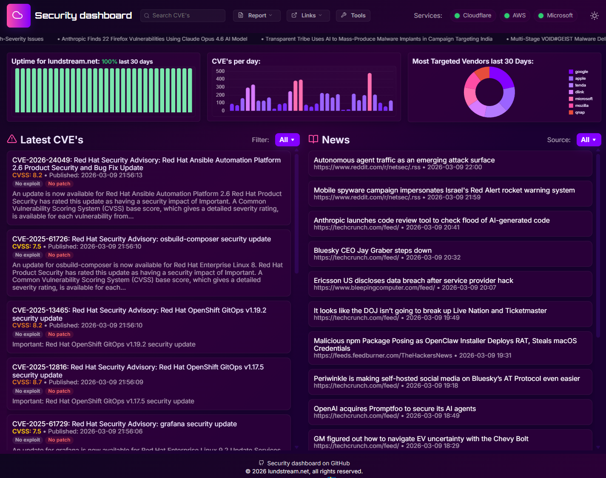

# SecurityDashboard

A real-time cybersecurity monitoring dashboard that aggregates the latest CVEs, security news, service uptime, and AI-powered vulnerability analysis — all in one place. It pulls data from public vulnerability databases (CIRCL, NVD) and RSS feeds, displays live service status for providers like Cloudflare, AWS, and Microsoft, and can generate weekly security reports with AI summaries in English and Swedish.

Built entirely through vibe coding in VS Code with GitHub Copilot (Claude Opus 4.6).

## Screenshot



## Disclaimer

SecurityDashboard comes with absolutely no warranty. Use at your own risk. This software is provided "as is" without warranty of any kind, express or implied. The authors are not responsible for any damages or losses arising from the use of this software.

## Requirements

- **Node.js** 18 or later
- **npm** (included with Node.js)
- **Git** (to clone the repository)
- **NVD API key** (optional, for enhanced CVE history — get one free at [nvd.nist.gov](https://nvd.nist.gov/developers/request-an-api-key))
- **GitHub Token** (optional, for AI analysis via GitHub Models API)

Or alternatively:

- **Docker** and **Docker Compose**

## Installation

### Option 1: Run with Node.js

```bash
# Clone the repository
git clone https://github.com/lundstream/SecurityDashboard.git
cd SecurityDashboard

# Install dependencies
npm install

# Copy the example settings and edit to your needs
cp settings.example.json settings.json

# Start the server
npm start
```

The dashboard will be available at `http://localhost:3000`.

### Option 2: Run with Docker

```bash
# Clone the repository
git clone https://github.com/lundstream/SecurityDashboard.git
cd SecurityDashboard

# (Optional) Set environment variables for AI and NVD
export AI_GITHUB_TOKEN=your_github_token
export NVD_API_KEY=your_nvd_api_key

# Build and start
docker compose up -d
```

To provide custom settings, mount your own `settings.json`:

```yaml
volumes:
  - ./settings.json:/app/settings.json:ro
```

### Configuration

Edit `settings.json` to configure:

- **Services** — Uptime monitoring targets (Cloudflare, AWS, Microsoft, or any custom URL)
- **RSS feeds** — News sources displayed on the dashboard
- **AI analysis** — Enable/disable, set GitHub token and model
- **Polling intervals** — How often CVEs, news, and uptime are refreshed
- **Ticker feed** — The scrolling news ticker RSS source
- **Footer text** — Custom footer message

## Included Libraries

| Library | Purpose |
|---------|---------|
| [Express](https://expressjs.com/) | Web server and API framework |
| [better-sqlite3](https://github.com/WiseLibs/better-sqlite3) | SQLite database driver |
| [node-fetch](https://github.com/node-fetch/node-fetch) | HTTP client for API calls |
| [cors](https://github.com/expressjs/cors) | Cross-origin resource sharing middleware |
| [Chart.js](https://www.chartjs.org/) | Charts and graphs (CDN, client-side) |
| [Feather Icons](https://feathericons.com/) | Icon set (CDN, client-side) |
| [html2pdf.js](https://github.com/eKoopmans/html2pdf.js) | PDF export for vulnerability reports (CDN, client-side) |
| [modern-normalize](https://github.com/sindresorhus/modern-normalize) | CSS reset (CDN, client-side) |
| [Google Fonts (Inter, Orbitron)](https://fonts.google.com/) | Typography (CDN, client-side) |

## License

MIT — see [LICENSE](LICENSE) for details.

 Quick start (local)
 1. Install dependencies: `npm ci`
 2. Start: `npm start` (serves on port `3000`)

 Docker / Portainer
 - Build & run locally:
   - `docker build -t lundstream/securitydashboard:latest .`
   - `docker run -d --name securitydashboard -p 3000:3000 --restart unless-stopped -e NVD_API_KEY=your_key lundstream/securitydashboard:latest`
 - Portainer stack (recommended): use the provided `docker-compose.yml` and set environment variables in the stack UI.

 Setting the NVD API key (do NOT commit the key)
 - Add the env var `NVD_API_KEY` to the container or stack in Portainer (Environment variables section).
 - Alternatively set `NVD_FEED_DIR` to a host path containing `nvdcve-1.1-YYYY.json.gz` files and mount that directory into the container as a volume.

 Manually trigger CVE history update
 - Run the helper script (key only in-memory):
   - PowerShell example (one-off):
     ```powershell
     $env:NVD_API_KEY='YOUR_KEY_HERE'
     cd C:\path\to\SecurityDashboard
     node scripts/update_cve_history.js
     ```
   - To use local feeds instead:
     ```powershell
     $env:NVD_FEED_DIR='C:\nvdfeeds'
     node scripts/update_cve_history.js
     ```

 Security & notes
 - Never commit `NVD_API_KEY` to source control. Use Portainer's environment variable UI or Docker secrets for production.
 - If NVD calls are blocked from your runtime the server will fall back to CIRCL and the 30-day history may be sparse.

 APIs
 - `/api/cves?count&offset` — latest CVE items
 - `/api/zero-days` — possible zero-day mentions
 - `/api/rss?count&offset` — aggregated news feed
 - `/api/uptime` — hourly uptime samples
 - `/api/cve-stats` — 30-day CVE-per-day counts (from `cve_history.json` or computed)

 Files of interest
 - [server.js](server.js) — server & background tasks
 - [public/app.js](public/app.js) — client logic and charts
 - [cve_history.json](cve_history.json) — persisted 30-day counts
 - [docker-compose.yml](docker-compose.yml) — Portainer/stack deployment
